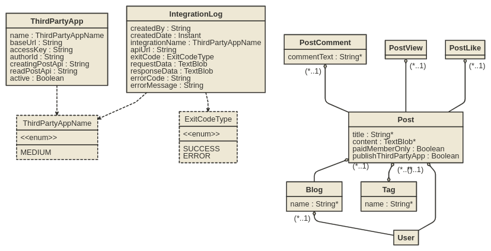
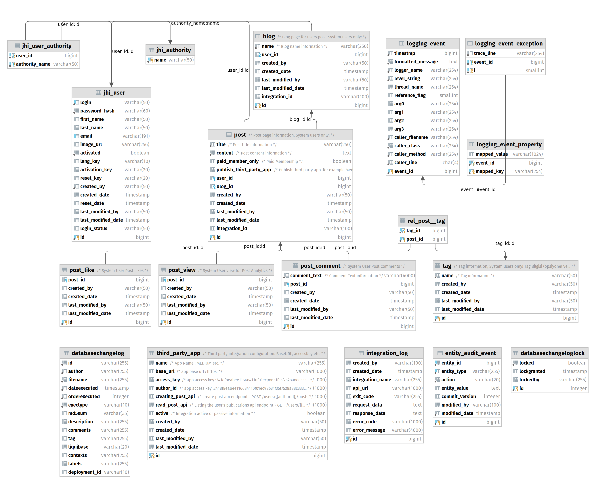

# Java Blog Page Web Application with Java-SpringFramework


## Project Structure

- Java
- SpringBoot
- Hibernate
- Database
    - Production: Postgres
    - Development: H2DB
- Liquibase
- Swagger
- Medium Integration

- `/src/*` structure follows default Java structure.
- `.github/workflows/main.yml` - GitHub Action file
- `pom.xml` - Dependency Configuration File
- `/src/main/docker` - Docker configurations for the application and services that the application depends on
- API-DOCS https://cevheri-blog.herokuapp.com/admin/docs
- default user/pass: admin/Admin.2022!
## Development

Before you can build this project, you must install and configure the following dependencies on your machine:

```
./mvnw
```

## Building for production

### Packaging as jar

To build the final jar and optimize the blog application for production, run:

```
./mvnw -Pprod clean verify
```

This will concatenate and minify the client CSS and JavaScript files. It will also modify `index.html` so it references these new files.
To ensure everything worked, run:

```
java -jar target/*.jar
```

Then navigate to [http://localhost:8080](http://localhost:8080) in your browser.


### Packaging as war

To package your application as a war in order to deploy it to an application server, run:

```
./mvnw -Pprod,war clean verify
```

## Testing

To launch your application's tests, run:

```
./mvnw verify
```

### Control Center

Control Center can help you manage and control your application(s). You can start a local control center server (accessible on http://localhost:7419) with:

```
docker-compose -f src/main/docker/jhipster-control-center.yml up
```

## Docker

Docker-compose configuration are available in the [src/main/docker](src/main/docker) folder to launch required third party services.

For example, to start a postgresql database in a docker container, run:

```
docker-compose -f src/main/docker/postgresql.yml up -d
```

To stop it and remove the container, run:

```
docker-compose -f src/main/docker/postgresql.yml down
```

You can also fully dockerize your application and all the services that it depends on.
To achieve this, first build a docker image of your app by running:

```
./mvnw -Pprod verify jib:dockerBuild
```

Then run:

```
docker-compose -f src/main/docker/app.yml up -d
```


#### Docker Hub integration
```
docker run -p 8080:8080 cevheri/java-blog-web-app:latest
```


---
## Continuous Integration
- GitHub Action Configuration File :

```.github/workflows/main.yml```

- Auto deploy heroku cloud platform.

---
## EntityModel


---

## Database Diagram


